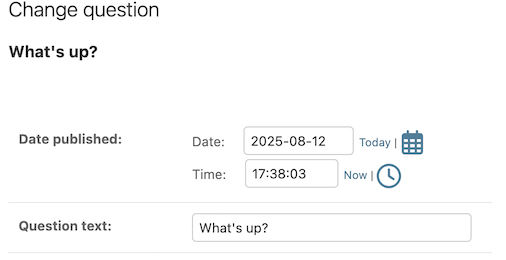
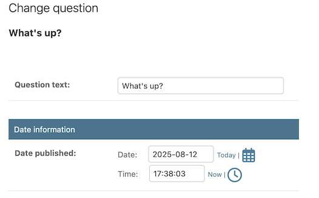
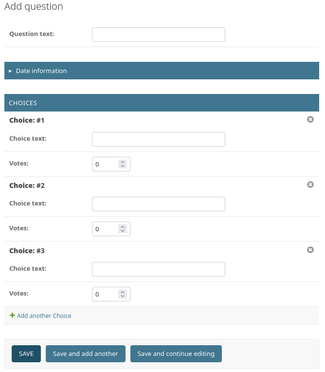
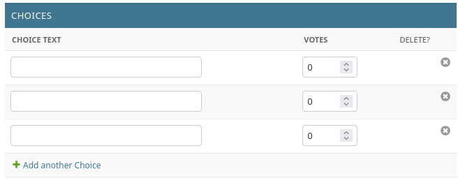
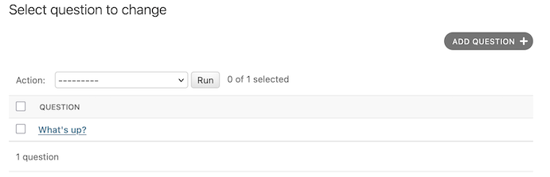
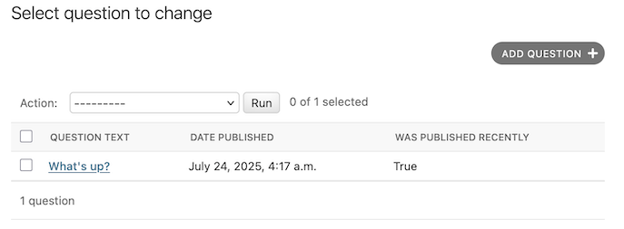
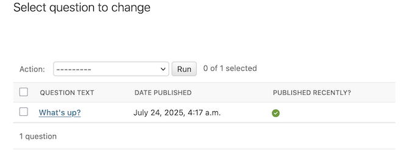

## 这一部分专注于后台

修改polls/admin.py文件，重新编排表单的字段，使得 "Publication date" 字段显示在 "Question" 字段之前：

    

    ```python
    from django.contrib import admin

    from .models import Question


    class QuestionAdmin(admin.ModelAdmin):
        fields = ["pub_date", "question_text"]


    admin.site.register(Question, QuestionAdmin)
    ```

对字段进行编排在具有多个字段的模型中尤其有用，可以帮助你创建更清晰、更易于使用的管理界面。

将表单分为多个字段集（就像把一个表单分成不同部分，每个部分有一个标题。这里的Data information字段就像这一部分的标题：

    

    ```python
    from django.contrib import admin
    from .models import Question

    class QuestionAdmin(admin.ModelAdmin):
        fieldsets = [
            (None, {"fields": ["question_text"]}),
            ("Date information", {"fields": ["pub_date"]}),
        ]

    admin.site.register(Question, QuestionAdmin)
    ```

### 添加关联对象
一个Question有多个Choice。但现在并没有显示出多个Choice。Django允许你在Question的编辑页面中直接添加和编辑Choice对象。 这通过使用内联模型实现：

    

    ```python
    from django.contrib import admin
    from .models import Question, Choice

    class ChoiceInline(admin.TabularInline):
        model = Choice
        extra = 3

    class QuestionAdmin(admin.ModelAdmin):
        fieldsets = [
            (None, {"fields": ["question_text"]}),
            ("Date information", {"fields": ["pub_date"]}),
        ]

        # 添加下面一行来显示关联的Choice对象
        # 这会告诉 Django：“Choice 对象要在 Question 后台页面编辑。
        # 默认提供 3 个足够的选项字段。”
        inlines = [ChoiceInline] 

    # 注册Question模型和它的管理类（不用注册Choice模型，
    # 因为它已经作为内联模型包含在Question中了）
    admin.site.register(Question, QuestionAdmin) 
    ```
在末尾还可以手动添加新的Choice对象

但这样有个问题，占据了大量的屏幕区域来显示所有关联的 Choice 对象的字段。对于这个问题，Django 提供了一种**表格式的单行显示关联对象**的方法。要使用它，只需按如下形式修改 ChoiceInline 申明：

    

    ```python
    class ChoiceInline(admin.TabularInline):
        ...
    ```

接下来更改 “change list”页面，即显示所有问题的页面，目前是这样：

    

默认情况下，Django 显示每个对象的 str()。但有时如果我们能显示多个字段会更有帮助。为此，请使用 list_display admin 选项，该选项是要在对象的“change list”页上以列形式显示的字段名称列表：

    ```python
    class QuestionAdmin(admin.ModelAdmin):
        ...
        list_display = ("question_text", "pub_date", "was_published_recently")
    ```

修改后是这样：

    

可以看到列标题的名字是变量名字（用空格替换了下划线；对于DATE PUBLISHED而不是PUB DATE，是因为在Question模型中有为pub_date字段指定了一个更友好的名字）。

此外，对于 was_published_recently是以True/False显示的。

如果想要自定义标题名字，并且更换更直观的显示方式（如用打勾打叉来表示布尔值），可以在 polls/admin.py的QuestionAdmin 中使用装饰器：

    ```python
    from django.contrib import admin

    class Question(models.Model):
        # ...
        @admin.display(
            boolean=True, # 将方法的显示类型设置为布尔值，并且在后台中显示为打勾打叉
            ordering="pub_date", # 按pub_date字段排序
            description="Published recently?", # 自定义标题
        )
        def was_published_recently(self):
            now = timezone.now()
            return now - datetime.timedelta(days=1) <= self.pub_date <= now
    ```

    

### 添加侧边栏过滤器
再次编辑文件 polls/admin.py，优化 Question 变更页：过滤器，使用 list_filter。将以下代码添加至 QuestionAdmin：

    ```python
    class QuestionAdmin(admin.ModelAdmin):
        ...
        list_filter = ["pub_date"]
    ```
这样做添加了一个“过滤器”侧边栏，允许人们以 pub_date 字段来过滤列表：

    

这里会自动生成用 Any date、Today、Past 7 days、This month 和 This year 来过滤的问题选项。是因为 pub_date 是一个 DateTimeField 字段，Django 能够识别它并提供适当的过滤选项。

### 搜索框
下面代码添加一个搜索框，当用户输入内容搜索时，程序会在 question_text 字段里进行搜索：

```python 
class QuestionAdmin(admin.ModelAdmin):
    ...
    search_fields = ["question_text"]
```

### 自定义模版
在 djangotutorial/djangotutorial/下创建templates/admin/base_site.html，然后在djangotutorial/djangotutorial/setting.py 添加一个全局的 templates 目录（改DIR部分）：

        ```python
        TEMPLATES = [
            {
                "BACKEND": "django.template.backends.django.DjangoTemplates",
                "DIRS": [BASE_DIR / "templates"],
                "APP_DIRS": True,
                "OPTIONS": {
                    "context_processors": [
                        "django.template.context_processors.request",
                        "django.contrib.auth.context_processors.auth",
                        "django.contrib.messages.context_processors.messages",
                    ],
                },
            },
        ]
        ```

将Django的管理界面模版（https://github.com/django/django/blob/main/django/contrib/admin/templates/admin/base_site.html）复制到base_site.html中，然后进行修改，

替换

`<div id="site-name"><a href="">{{ site_header|default:_('Django administration') }}</a></div>`

成为

`<div id="site-name"><a href="">Polls Administration</a></div>`：

```html
s


{{ subtitle }} | {{ title }} | {{ site_title|default:_('Django site admin') }}


<div id="site-name"><a href="">Polls Administration</a></div>

  




```s